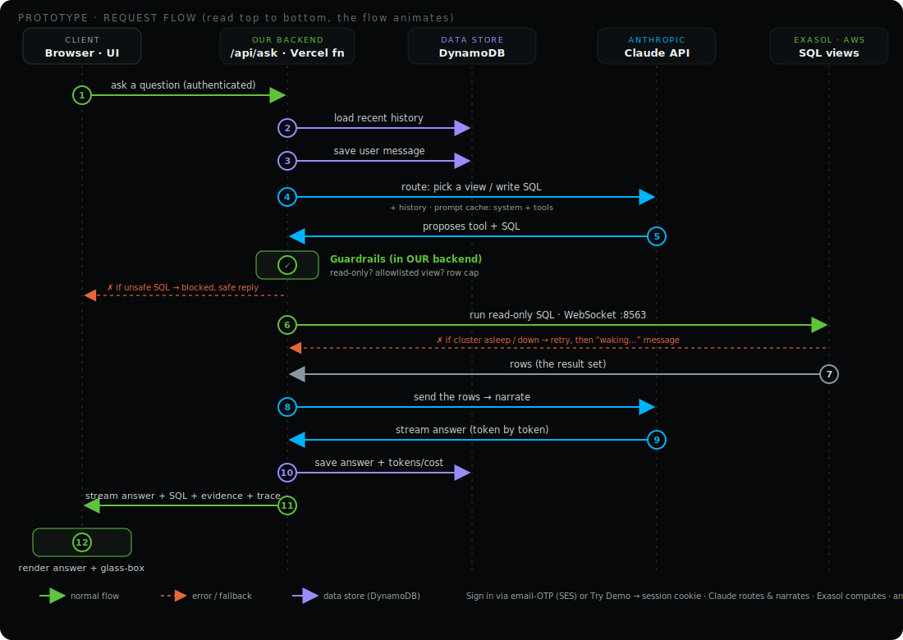
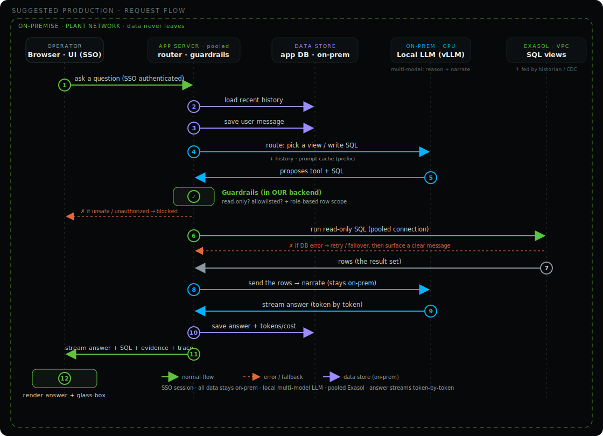

# PlantPulse AI — natural-language plant operations assistant, powered by Exasol

A plant manager asks in plain English and gets an **evidence-backed answer**. **Exasol does all the analytical thinking** — machine health, risk scoring, downtime and repeated-error detection live in SQL views — and a **thin LLM layer only routes the question to the right view and narrates the rows**. Every answer shows the exact SQL and data behind it, with a glass-box trace of how it was built.

**▶ Live demo: https://plant.appili.dev** — click **Try Demo** for instant access (no sign-up).

> Built for the Exasol Prototype Challenge. A customer-demo-style prototype, not a production system.

---

## What it does

Ask things like:

- **“Which machines need attention today?”** → a prioritized list with reasons and recommended actions
- **“Why is M-102 high risk?”** → the risk score broken into its contributing factors
- **“Show me Pune Plant’s downtime trend”** → a narrated answer with a chart and the underlying table
- **“Which plant has the most downtime this week?”** → ranked, with the numbers
- **“Show machines with repeated errors”** → repeated-error machines

Every answer is grounded in live Exasol data, shows its SQL and rows, and offers tappable follow-up questions.

---

## Highlights

- **Grounded by construction** — the model never computes a number. It calls a curated Exasol view (or a guarded read-only `SELECT`), and narrates the rows.
- **Glass-box trace** — each answer reveals the live signal path: question → route → the exact SQL → rows → narration, plus a prompt-cache efficiency line.
- **Grounded charts** — trends and comparisons render as a chart drawn from the evidence rows (never from numbers the model writes).
- **Streaming** — answers stream in token by token.
- **Passwordless access** — email one-time-passcode login, plus an anonymous **Try Demo** mode.
- **Conversation history** — multi-turn chat with a sidebar of past conversations.
- **PDF export** — a branded report of any conversation (tables and charts included).
- **Admin dashboard** — per-conversation and per-message cost, tokens, latency, and the same glass-box trace.
- **Cost-aware** — Anthropic prompt caching on the static system + tools prefix (typically 80%+ of input served from cache on follow-ups).

---

## Screenshots

**Prototype architecture (the request flow):**



**Suggested production architecture (on-prem LLM, data never leaves the plant network):**



> Animated, self-explanatory versions (with assumptions) are on the live site: **https://plant.appili.dev/architecture**

<!-- App screenshots (chat answer + chart, glass box, admin) to be added under docs/screenshots/ -->

---

## How it works

**The truth lives in Exasol.** The LLM is a thin, auditable translation layer, so answers are grounded by construction, the model stays cheap and fast, and anyone can verify an answer by running the same SQL. Crucially, **the guardrails run in the backend**: the model *proposes* a tool or SQL, the backend *enforces* read-only + an allowlist + a row cap before anything runs.

**Stack:** Next.js (App Router, all-TypeScript) on Vercel · Exasol (SaaS trial or Community Edition) via `@exasol/exasol-driver-ts` (WebSocket) · Claude via the Anthropic SDK (model configurable) · AWS DynamoDB + SES for the multi-user layer (auth, history, cost logging).

---

## Run it locally

### 1. Prerequisites
- **Node 22** — an `.nvmrc` is included, so `nvm use` selects it (Next.js 16 requires Node ≥ 22.12).
- **An Exasol database** — either the **SaaS trial** (free, 30 days) or **Community Edition** via the included `docker-compose.yml`.
- **An Anthropic API key** for the assistant layer.
- *(Optional, for the multi-user layer)* AWS DynamoDB + SES — only needed if you want login, conversation history, and cost logging locally. The fastest way to evaluate those is the live demo.

### 2. Environment — copy `.env.local.example` to `.env.local`

**Core (required to run the assistant):**

| Variable | Purpose |
|---|---|
| `EXASOL_HOST`, `EXASOL_PORT` | Exasol host and port (`8563`) |
| `EXASOL_USER`, `EXASOL_PASSWORD` | Exasol credentials (on SaaS, the password is a Personal Access Token) |
| `EXASOL_SCHEMA` | Defaults to `PLANTOPS` |
| `EXASOL_ENCRYPTION` | `true` (SaaS) |
| `EXASOL_TLS_VERIFY` | `true` for SaaS; `false` for Community Edition (self-signed cert) |
| `ANTHROPIC_API_KEY` | Anthropic API key — the assistant uses Claude |
| `ANTHROPIC_MODEL` | Claude model id (e.g. `claude-sonnet-4-6`) |

**Multi-user layer (optional — login, history, cost logging):**

| Variable | Purpose |
|---|---|
| `PP_AWS_REGION`, `PP_AWS_ACCESS_KEY_ID`, `PP_AWS_SECRET_ACCESS_KEY` | AWS creds for DynamoDB + SES |
| `PP_SES_FROM` | Verified SES sender for the sign-in code email |
| `PP_JWT_SECRET` | Secret used to sign the session cookie |
| `PP_SUPER_ADMIN` | Comma-separated emails allowed into `/admin` |
| `PP_CHAT_HISTORY` | Feature flag for the conversation sidebar (`on`/`off`) |

**Exasol SaaS:** create an XSmall database; use its host, port `8563`, the user + a Personal Access Token; `EXASOL_TLS_VERIFY=true`; add your IP (or `0.0.0.0/0`) to the database’s IP allowlist.

**Exasol Community Edition:**
```bash
docker compose up -d        # wait ~1–2 min until ready
# .env.local: EXASOL_HOST=localhost  EXASOL_USER=sys  EXASOL_PASSWORD=exasol  EXASOL_TLS_VERIFY=false
```

### 3. Install and seed
```bash
nvm use
npm install
npm run seed
```
This **creates the schema, loads the mock data, and builds the views**, then prints the demo signals so you can confirm it landed.

- **Different/random data:** `npm run seed -- --seed 99` (any number) regenerates a fresh dataset; the planted demo scenarios are preserved.
- Re-seeding is **destructive and idempotent** — it runs `DROP SCHEMA … CASCADE` first, so every run wipes and recreates the schema, data, and views.

### 4. Run
```bash
npm run dev        # http://localhost:3000
```
Or exercise it from the terminal (no UI / no auth needed):
```bash
npm run ask -- "Why is M-102 high risk?"                 # end-to-end assistant test
npm run sql -- "SELECT * FROM PLANTOPS.V_PLANT_HEALTH"   # ad-hoc read-only query
npm run peek                                             # quick overview of the loaded data
```

---

## Repository layout

```
db/schema.sql        Star-schema DDL (tables)
db/views.sql         Analytics views — all risk/health/downtime logic (the brain)
scripts/seed.ts      Mock-data generator (planted demo stories) + loader  [--seed N]
scripts/ask.ts       End-to-end assistant test from the CLI
lib/exasol.ts        Connection helper (per-request connect, with retry)
lib/tools.ts         Assistant tool surface (curated views + guarded text-to-SQL)
lib/assistant.ts     Router → Exasol → narrator loop; emits the glass-box trace
lib/store.ts         DynamoDB persistence (conversations, messages, cost)
lib/otp.ts           Email one-time-passcode (AWS SES)
app/api/ask          Streaming endpoint the UI calls (auth + guardrails enforced here)
app/page.tsx         The chat UI (streaming, charts, glass box)
app/admin            Admin dashboard (cost, tokens, transcripts)
app/architecture     Architecture pages (assumptions + animated diagrams)
public/architecture*.svg   The architecture diagrams
docs/model-strategy.md     Single vs. multi-model decision record
docker-compose.yml   Exasol Community Edition for local reproducibility
```

---

## The data (and its planted stories)

Small but sufficient: **3 plants, 6 production lines, 18 machines**, ~3 weeks of hourly sensor readings (~9,000 rows), plus error logs, downtime events and maintenance records. The generator is deterministic and **deliberately plants scenarios** so answers are non-trivial:

- **M-102 (Hyderabad)** — vibration ramps to ~32% above baseline + severe E5xx errors → **HIGH risk**.
- **Pune Plant** — a bad downtime week (~540 min in 7 days) → clearly the most downtime.
- **M-107 / M-115** — the same error code repeated through the week → repeated-error detection.
- **M-110** — maintenance overdue + mild vibration → maintenance-driven risk.

## The risk model (explainable on purpose)

`V_RISK_SCORE` computes a 0–100 score as the sum of four capped components, so every score decomposes into *why*:

| Component | Max | Basis |
|---|---|---|
| Vibration | 40 | % over the machine’s baseline |
| Errors (24h) | 30 | severe (E5xx) ×8, others ×3 |
| Downtime (7d) | 20 | 1 point per 15 downtime-minutes |
| Maintenance | 10 | overdue = 10 |

Bands: **HIGH ≥ 60**, **MEDIUM ≥ 30**, else **LOW**.

---

## Responsible AI / guardrails

- The model **cannot compute analytics** — it can only call a curated tool (each backed by one view) or a guarded read-only SQL escape hatch.
- **Read-only:** generated SQL must be a single `SELECT`; DDL/DML keywords are rejected.
- **Allowlist:** generated SQL may reference only the curated `PLANTOPS.V_*` views — never base tables or system schemas. There is a row cap.
- **Enforced in the backend**, not by the model: the model proposes SQL; the backend validates it before running.
- **Show your work:** the exact SQL is surfaced in the UI (Evidence panel + Signal Path), and charts are drawn only from those rows.
- **No hallucination:** if the data does not support an answer, the assistant says so.

---

## Tradeoffs (simplified for the prototype) → production

| Prototype | Production |
|---|---|
| Mock, planted data | Real ingestion (historian / PLCs / CDC into Exasol) |
| Per-request DB connection (serverless) | Pooled, long-lived connections |
| Curated tools + small guarded text-to-SQL | Broader semantic layer, query review/approval |
| Cloud LLM (Claude) | **On-prem local LLM** (Llama/Mistral via vLLM) so data never leaves the network — the thin layer makes this a config/adapter swap |
| Email-OTP login + Try Demo | SSO + role-based access; per-plant data scoping |
| Single model | Multi-model routing (see `docs/model-strategy.md`) |
| Fixed risk weights | Configurable, plant-specific thresholds; alerting/escalation |

---

## Why Exasol

Exasol is the analytical engine doing the real work: every risk score, trend, and ranking is computed in SQL views — in-memory, columnar, MPP, fast, and in one place. The assistant is deliberately thin so correctness and performance live in the database, which is exactly where an analytics-heavy operations workload belongs.
